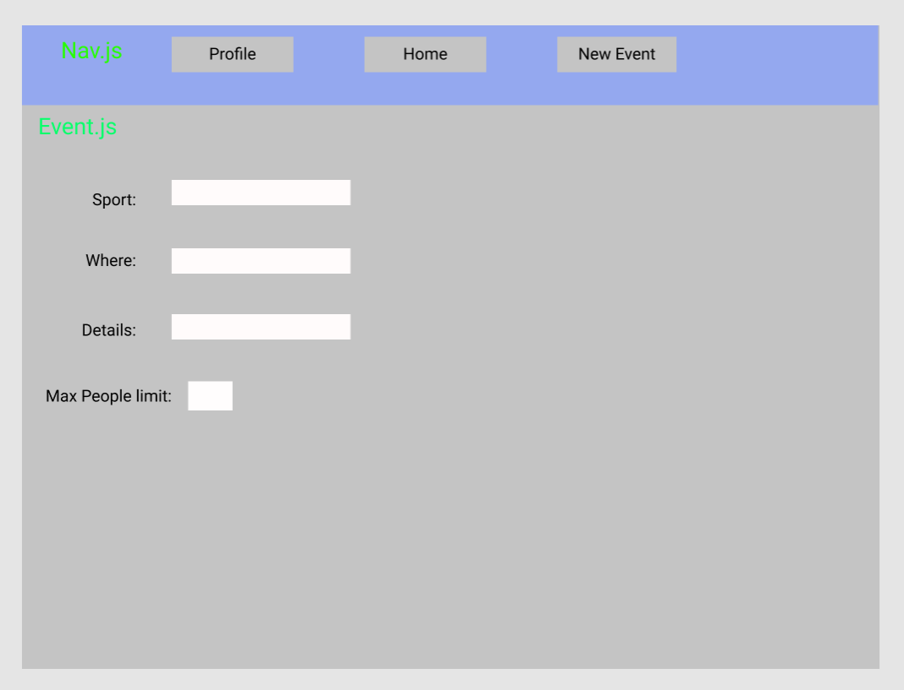

# Sports Connect App

## Application Concept and Wireframe

### Application Concept
 
- What is the purpose of this app?
    - A platform where people can plan sporting activities with people that live in their general area.

- What problem does this app solve?
    - One of the hardest parts of playing sports (especially the ones that require big teams) is finding enough people to play that sport. Also it is difficult to know and keep track of what sporting events and tournaments are going on in your area.

- How does it solve those problems?
    - This app will allow people to connect with one another on a social platform with the focus of sports. People will be able to post when and where they are going to play. 
    - Also tournaments and big events can be posted for everyone.

- Who is your target audience?
    - Any active individual but especially young adults.

### MVP:
- Create an account
- Can add/edit/delete Posts
- Can interact with other posts
    - Track location of user to see events nearby
    - Make groups

### Components
- App.js - Holds Nav.js and Routes.js
	
- Auth.js -  Holds username and password on state. Has function loginUser that will send a 	post request to server. Will send first name last name and email to redux

- Register.js - Will register new user and will hold username and password on state. Has function registerUser that will send a post request to server will send first and last name 		to redux.

- Nav.js - Will hold links to the other pages and also the logo

- Header.js -   Will have componentDidMount send a get request to receive all of the posts. Will have posts on state as an array of objects. Will pass posts down as props to Post.js. editPost will send a put request. deletePost will send a delete request.

- Post.js - functional component will create posts and receive props from Header.js

- Profile.js - will have an object of favorites at the bottom. Will receive name, email, and profile pic from redux. Will send a put request to edit state. Will have a get request to get favorites. Will have a post request to add to favorites.

- Event.js - createNew will send a post request and create a new post. Will have sport, location, details, maxLimit on state.

## Endpoints
- Auth
    - Post - Logging in user '/api/auth/login', loginUser
        - Receive: req.body{
            username:'user'
            password: 'pass'
        }
        - Send:{ 
            username: 'user',
            profile_pic: 'img',
            id: 1,
            name: "Sam Tanner"
        }
    - Post - Register new user '/api/auth/register', registerUser
        - Receive: req.body{
            username:'user'
            password: 'pass'
        }
        - Send:{ 
            username: 'user',
            profile_pic: 'img',
            id: 1,
            name: "Sam Tanner"
- Dashboard
    - Get - Retrieve all posts '/api/post', getPosts
        - Receive: posts
    - Get - Search through posts '/api/post/:userid', searchPosts
        - Receive: req.params.sports
            req.query {
                search: 'spikeball',
                spikeball: true
            }
        - send:[{
                sport: 'spikeball',
                location: 'arizona',
                details: 'hello',
                maxLimit: 20,
                name: 'Sam'
                 
            }]

    - Delete - delete a post '/api/post/:post_id', deletePost

- Profile

    - Get - Retrieve all favorites '/api/profile/:favorites_id', getFavorites
        - Receive: req.params.favorites_id
        - Send: {
            sports: []
        }

    - Post - Add favorites '/api/profile/:favorites_id', addFavorite
        - Receive: req.params.favorites_id 
            - req.body{
                sports:[volleyball, spikeball, soccer]
            }
    - Get - Retrieve info of user '/api/profile/:user_id', getUser
        Receive: req.params.user_id
        Send: {
            username: '',
            name: '',
            profile_pic: ''
 
        }
    - Put - Edit user info '/api/profile/:user_id', editUser 
        - Receive: req.params.user_id
            - req.body{username:'',
                    name:'',
                    profile_pic: ''}
        - Send: {
            username:'',
            name: '',
            profile_pic: ''
        }

- Event

    - Post - add new post 'api/event/post_id', addPost
        - Receive: req.params.post_id
            - req.body{
                sport:''
                location:''
                details:''
                maxLimit: 45
            }
    - Get - get user info 'api/event/post_id', getUser
        - Receive: req.params.post_id
        Send: {
            name: '',
            profile_pic: ''
        }

## Point Plan

- Core 30/45
    - 3 responsive views Auth.js, Dashboard.js, Profile.js  10 points
    - React Redux read from store with getUser and write to store with registerUser 10 points
    - Authentication Auth.js and Register.js 10 points
    
- Additional Technologies 30/30
    - NodeMailer  10pts
    - Sass 10pts
    - Geolocation 10pts

- Hosting 15/15
    - Successfully Hosted 10 points
    - Registered under unique domain name 5 points

- 75/90

